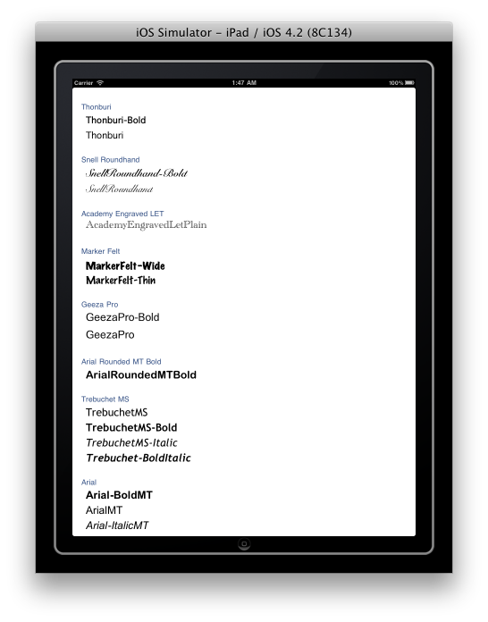
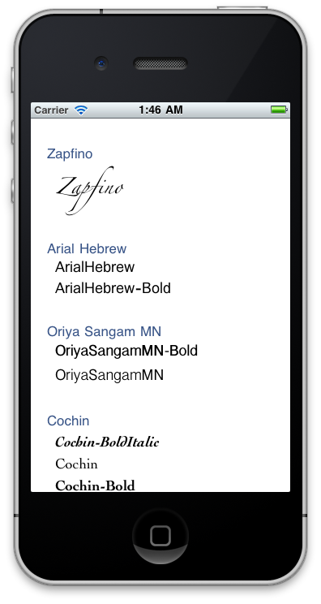
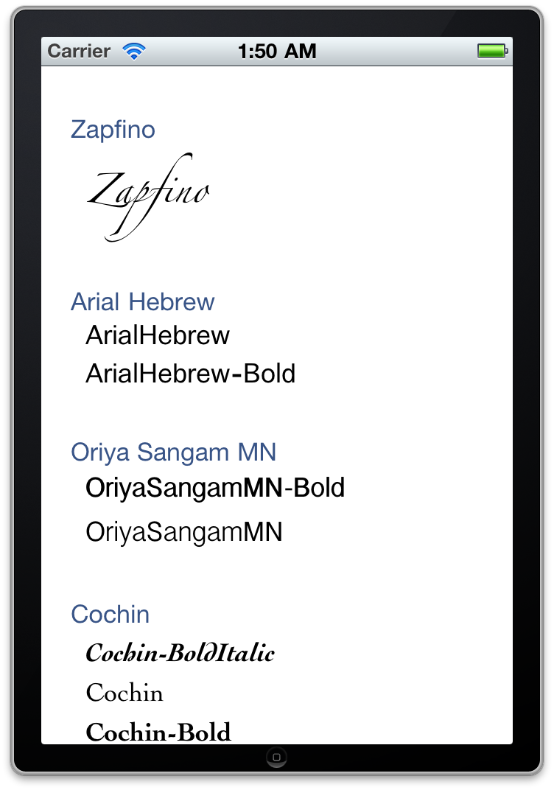

iOSFontList README
==================

Description
-----------
Displays all available font names and families on iOS in their corresponding font.

The intention is to help developers choosing an appropriate font.

To test the custom font support I added the great Inconsolata: http://www.levien.com/type/myfonts/inconsolata.html

Screen Shots
------------

Raphael Schaad, 2010
